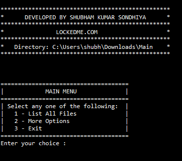

# LockedMe.com

## Table of Contents

- [General Info](#general-info)
- [Using the application](#using-the-application)
- [Technologies](#technologies)

## General Info

A simple file handling project in java.

## Using the application

Welcome screen displays the application name, developer details, directory information and main menu.

The user has to select option from the user interface shown.

    1. The first option list the current file names in ascending order. User can enter the desired directory name in Main.java.

        2. The second option returns the details of the user interface with following options.

            a. Add a file to the existing directory list.

            b. Delete a user specified from the existing directory list.

            c. Search a user specified file from the main directory.

            d. option to navigate back to main menu.

## Technologies

Technologies used in project:

- java 8
- Eclipse
